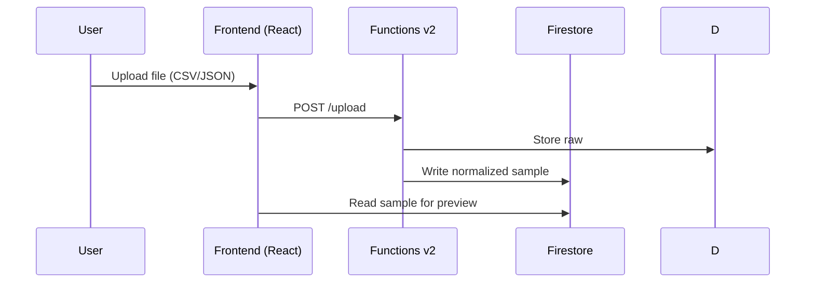

# Architecture Overview

The system is a single Firebase project (for now) with a React frontend, Firebase Functions v2 backend, and shared models.

```mermaid
flowchart LR
  subgraph Client
    A[React App]
  end
  subgraph Firebase
    B[Functions v2 (EU-W2)]
    C[Firestore]
    D[Storage]
    E[Auth]
  end
  A <--> E
  A --> B
  B <--> C
  B <--> D
```



