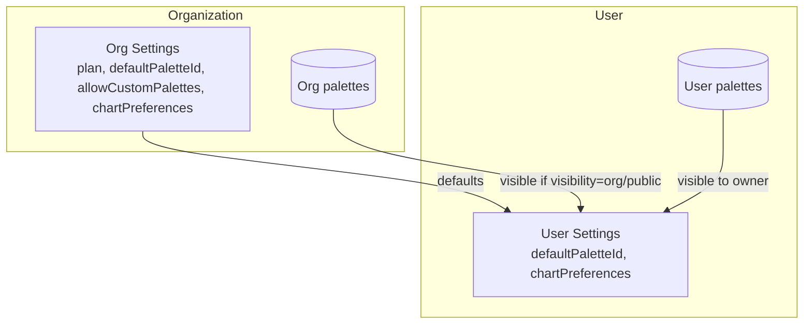

# Tenant hierarchy and palette rules

## Rules
- Plan tiers: `free`, `pro`, `business`.
  - `free`: 2 system palettes only; `allowCustomPalettes=false`.
  - `pro+`: custom palettes allowed; org owner can set org default; users can set personal default.
- Palette visibility: `org` (org-wide), `user` (owner only), `public` (system/defaults).
- Preference resolution: User settings override Org defaults; missing values fall back to org → system defaults.
- All routes require auth; Google sign-in to start.

## Data model
- Organization settings: `organizationSettingsSchema` (in `shared/src/models.ts`).
- User settings: `userSettingsSchema` (in `shared/src/models.ts`).
- Palettes: `colorPaletteSchema` with `ownerId`, `organizationId`, `visibility`.

## Storage (Firestore suggested)
- `organizations/{orgId}/settings` → OrganizationSettings
- `organizations/{orgId}/palettes/{paletteId}` → ColorPalette (visibility=org)
- `users/{uid}/settings` → UserSettings
- `users/{uid}/palettes/{paletteId}` → ColorPalette (visibility=user)
- System palettes shipped in app/config and occasionally synced.
